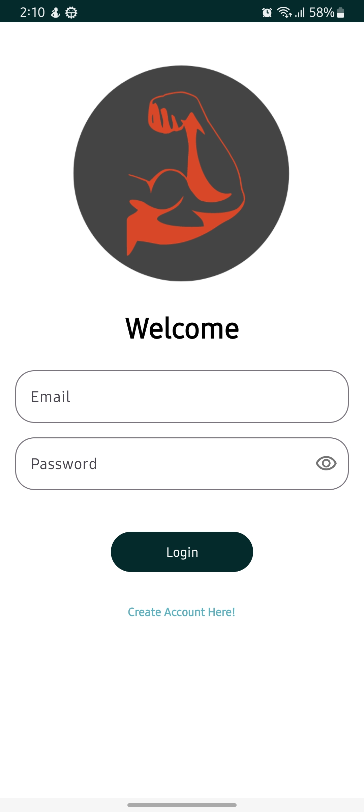
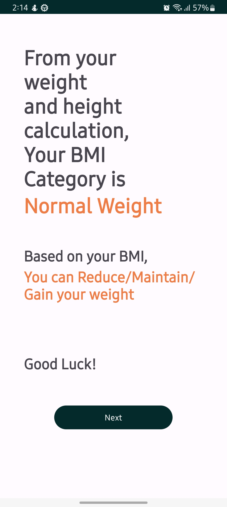
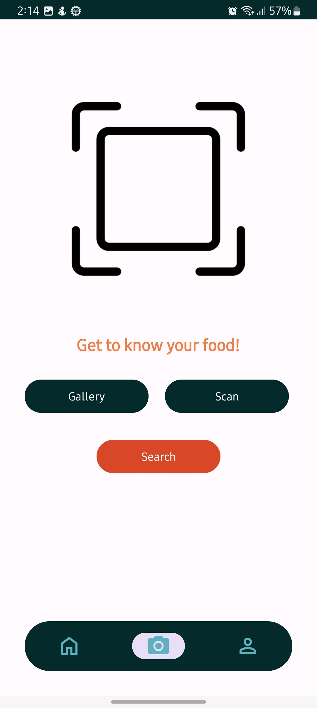
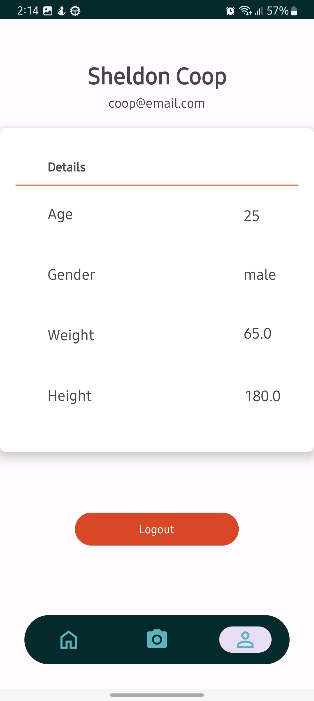

# Android Development

# Library 
### These are the libraries i used for developing the android application
<li>Firebase Authentication</li>
<li>Firebase Firestore</li>
<li>AndroidX</li>
<li>Tensorflow lite</li>

# Application Documentation
### Login Page

### Register Page

### After Registration

### Main Page

### Search Page

### Account Page

